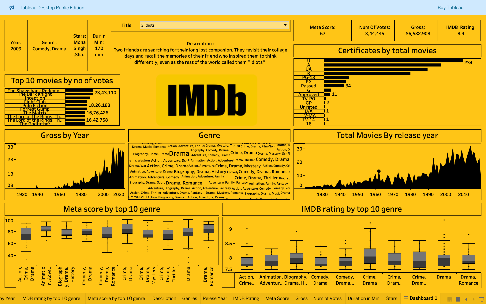
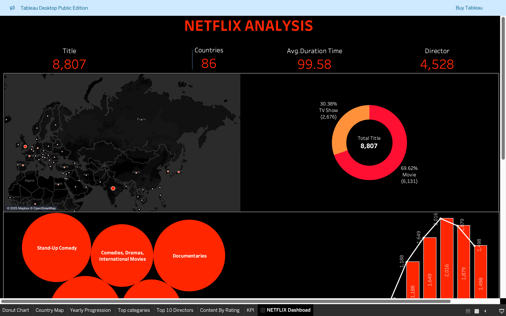

# Tableau Dashboards Repository

This repository contains two guided Tableau dashboards that analyze IMDb ratings and Netflix content trends.

## Dashboards

### 1. IMDb Ratings Analysis
This dashboard analyzes IMDb movie ratings and trends, showcasing key insights like the distribution of ratings, the most popular genres, and trends over time.

### 2. Netflix Analysis
This dashboard visualizes Netflix content and genre trends, helping users understand the types of content available, popular genres, and viewing patterns over time.

## Files
- **IMDb Ratings Analysis.twbx**: Tableau workbook for analyzing IMDb movie ratings.
- **Netflix Analysis.twbx**: Tableau workbook for analyzing Netflix content and genre trends.

## How to Use
1. Download the `.twbx` files to your local machine.
2. Open the files using **Tableau Desktop**.
3. Interact with the dashboards to explore the data and insights.

## Requirements
- Tableau Desktop or Tableau Reader is required to view the `.twbx` files.

## License
This project is licensed under the MIT License.

